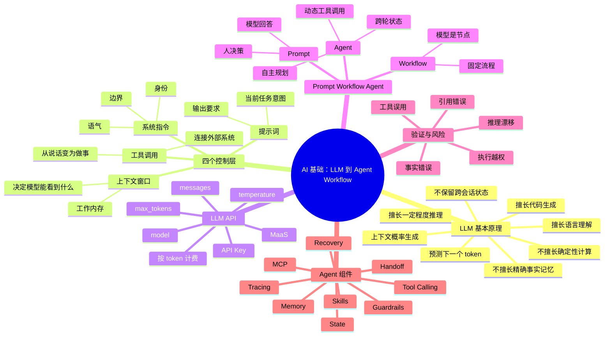
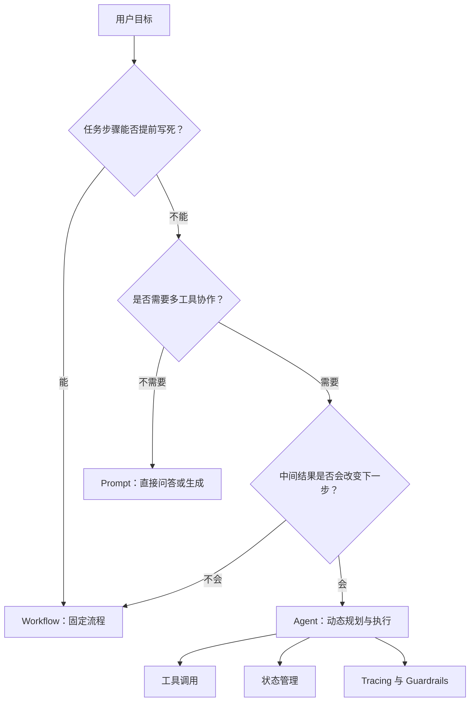
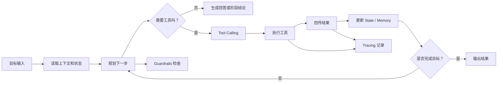

# vergissxie

**GitHub ID:** vergissxie

**Telegram:** 

## Self-introduction

AI x Web3 School

## Notes

<!-- Content_START -->
# 2026-05-18
<!-- DAILY_CHECKIN_2026-05-18_START -->
````markdown
# Week 1 模块 A：AI 基础，从 LLM 到 Agent Workflow

## 学习目标

本模块的目标是建立一条完整认知链路：

从理解“大模型是什么”，到知道“如何调用 LLM API”，再到分清 “Prompt、Workflow、Agent” 的边界，最后能判断什么时候该用 agent，什么时候不该过度 agent 化。

一句话概括：

> LLM 本身负责基于上下文生成内容；workflow 负责把任务流程固定下来；agent 则让模型在目标约束下动态规划、调用工具、管理状态。

## 思维导图



## 1. LLM 是什么

LLM，全称 Large Language Model，大语言模型。它的核心能力不是“查数据库”，也不是“真正理解世界”，而是：

> 在给定上下文中，预测最合理的下一个 token 序列。

这里的 token 可以粗略理解为文本片段。模型看见前面的内容后，会根据训练中学到的统计模式、语义关系和推理模式，生成后续内容。

### LLM 擅长什么

| 能力 | 解释 |
| --- | --- |
| 语言理解 | 能总结、改写、翻译、分类、提取关键信息 |
| 代码生成 | 能根据上下文写样板代码、解释库用法、辅助调试 |
| 模式迁移 | 能把一个例子中的结构迁移到新任务里 |
| 初步推理 | 能完成多步骤分析，但需要拆解和验证 |

### LLM 不擅长什么

| 短板 | 原因 |
| --- | --- |
| 精确事实记忆 | 模型参数不是实时数据库，知识可能过期或混淆 |
| 确定性计算 | 生成式模型会“估算式输出”，复杂计算应交给工具 |
| 引用可靠性 | 可能编造论文、链接、作者或数据来源 |
| 跨会话状态 | 模型默认不记得上次对话，除非系统提供记忆机制 |

## 2. 四个控制层面

使用 LLM 时，可以把控制方式分成四层。

| 控制层 | 负责什么 | 类比 |
| --- | --- | --- |
| 上下文窗口 | 模型当前能看到多少信息 | 工作内存 |
| 系统指令 | 设置身份、语气、边界和规则 | 角色设定与行为规范 |
| 提示词 | 表达当前任务、输入材料和输出格式 | 当前任务单 |
| 工具调用 | 让模型调用外部能力并获得结果 | 手、眼睛和仪表盘 |

关键理解：

上下文窗口不是长期记忆。它只是本轮能看到的材料。如果重要信息没有放进上下文，模型就无法稳定使用它。

系统指令比普通提示词更像“运行规则”。它通常用来定义 agent 的身份、禁止事项、工具边界、输出风格和安全规则。

提示词是任务级输入。它决定这一次要做什么、材料是什么、输出成什么格式。

工具调用把模型从“只会说话”变成“可以行动”。例如读文件、查网页、跑测试、访问数据库、调用 API。

## 3. 动手调用 LLM API

MaaS，即 Model as a Service，意思是把大模型作为云服务调用。你不需要自己买 GPU、部署模型，只需要使用 API Key，按 token 计费。

一次最小调用通常包含：

| 参数 | 作用 |
| --- | --- |
| `model` | 选择要调用的模型 |
| `messages` | 提供系统指令、用户输入和历史上下文 |
| `temperature` | 控制随机性，越低越稳定，越高越发散 |
| `max_tokens` | 控制最多生成多少 token |

建议学习路径：

1. 先从 OpenAI、Anthropic 或 GLM 的官方 Quick Start 跑通第一个请求。
2. 只改一个变量，例如先固定 `model` 和 `messages`，再比较不同 `temperature` 的输出差异。
3. 把一次 API 请求记录到 `demos/` 或 `logs/` 中，包括输入、输出、问题和改进。
4. 不要把 API Key 写进仓库。使用环境变量或本地配置文件。

## 4. Prompt、Workflow、Agent 的边界

这是本模块最重要的概念分界。

| 类型 | 决策者 | 路径是否固定 | 模型角色 | 适合场景 | 风险 |
| --- | --- | --- | --- | --- | --- |
| Prompt | 人 | 不涉及流程 | 回答者 | 一次性问答、总结、改写 | 输出可能错，但影响范围小 |
| Workflow | 人或系统设计者 | 固定 | 流程中的一个节点 | 固定步骤的批处理、审核流、报告生成 | 流程错会稳定地产生错结果 |
| Agent | 模型参与决策 | 动态 | 规划者和执行者 | 开放目标、多工具协作、迭代探索 | 行为更难预测，需要 guardrails |

### 从 Prompt 到 Agent 的流程图



## 5. AI Coding 工具的价值与限制

Claude Code、Codex CLI、Cursor 等工具的核心价值是把 LLM 放进真实开发环境里，让模型能读取代码、编辑文件、运行命令、解释错误。

### 能显著加速的事情

- 生成项目骨架和样板代码
- 解释陌生库、陌生框架和报错信息
- 快速写 demo 或 prototype
- 补充测试用例
- 整理文档、README、复盘记录
- 在已有代码风格下做小范围修改

### 不能完全替代的事情

- 架构取舍
- 安全边界设计
- 测试策略设计
- 代码审查责任
- 产品需求判断
- 对业务数据和真实用户影响的负责

更准确的心态是：

> AI coding 工具是能力放大器，不是责任转移器。

## 6. 为什么 AI 输出必须验证

AI 输出看起来流畅，不等于正确。越像“专业答案”，越要保持验证习惯。

| 风险 | 表现 | 应对方式 |
| --- | --- | --- |
| 事实错误 | 自信编造不存在的信息 | 关键事实外部核实 |
| 引用错误 | 编造论文、链接、数据来源 | 不直接信任模型给的引用 |
| 推理漂移 | 长上下文中结论偏离前提 | 分段验证、让模型列假设 |
| 执行越权 | agent 做了超出授权范围的操作 | 设置权限边界和人工确认 |
| 工具误用 | 调错工具或参数 | 使用 tracing 观察执行链 |

验证不是“怀疑 AI 没用”，而是把 AI 放进可靠工作流的一部分。

## 7. Agent 核心技术组件

Agent 不是单个 prompt。它通常是一组组件协作出来的系统。

| 组件 | 作用 | 简单理解 |
| --- | --- | --- |
| State 状态管理 | 多节点共享读写当前任务状态 | 当前任务的白板 |
| Long-term Memory 长期记忆 | 跨 session 存储与召回信息 | 笔记本或档案柜 |
| MCP | 统一连接外部工具和数据源 | 工具插座协议 |
| Skills | 可复用的高层指令和流程 | 标准作业手册 |
| Tool Calling | 模型输出结构化调用请求 | 让模型调用函数 |
| Tracing | 记录并可视化执行链 | 行动录像 |
| Guardrails | 输入输出校验与安全约束 | 护栏和红线 |
| Handoff | 子任务完成后移交控制权 | 交接单 |
| Error Recovery | 失败后的重试、回退、人工介入 | 故障恢复机制 |

### Agent 运行流程图



## 8. 什么时候需要 Agent

适合 agent 的信号：

- 目标开放，无法提前写死所有步骤
- 需要多工具协作，例如搜索、读文件、写代码、跑测试
- 中间结果会决定下一步策略
- 需要跨轮保存状态或长期积累资料
- 任务需要探索、试错、回退和迭代

不适合 agent，或应使用更简单方案的信号：

- 一次性问答：用 Prompt
- 流程固定：用脚本或 Workflow
- 强合规场景：加人工审核节点
- 数据确定性要求高：直接查数据库或调用确定性服务
- 风险高但收益低：不要为了“显得智能”而 agent 化

判断口诀：

> 步骤固定就 workflow，答案一次性就 prompt，路径会变且要用工具才考虑 agent。

## 9. 常见问题解释

### Q1：LLM 为什么会“幻觉”？

因为它的核心机制是生成最合理的文本序列，而不是从事实数据库中逐条检索。只要上下文不足、训练记忆混淆或任务要求过强，模型就可能生成看似可信但实际不存在的信息。

### Q2：上下文窗口越大，模型就越聪明吗？

不一定。大上下文能让模型看到更多材料，但不保证它会正确关注重点。长上下文还可能带来信息干扰和推理漂移，所以长材料要分段处理、结构化摘要、逐步验证。

### Q3：temperature 应该怎么设？

如果任务要求稳定、准确、格式一致，使用较低 temperature。如果任务要求创意、发散、头脑风暴，可以提高 temperature。学习和编码场景通常优先稳定。

### Q4：Tool Calling 和 Agent 是一回事吗？

不是。Tool Calling 是一种能力：模型可以请求调用工具。Agent 是一种系统形态：模型会围绕目标进行规划、选择工具、读取结果、更新状态并继续下一步。Agent 通常使用 Tool Calling，但 Tool Calling 本身不等于 Agent。

### Q5：为什么 coding agent 写完代码还要人审？

因为 agent 可能误解需求、漏掉边界条件、写出看似通过但不可维护的代码，或者没有覆盖真实业务风险。人仍然要负责架构判断、测试设计、安全边界和最终合并。

### Q6：如何降低 agent 失控风险？

关键是把权限、状态和验证机制设计清楚：限制可用工具，明确禁止事项，关键操作要求人工确认，记录 tracing，输出前跑测试或做格式校验。

## 10. 本模块学习产出建议

建议把 Week 1 模块 A 的学习成果沉淀成四类文件：

- `notes/week1-module-a-ai-basics.md`：本笔记
- `prompts/week1-module-a-note-prompt.md`：把课程材料整理成结构化笔记的 prompt
- `logs/YYYY-MM-DD-week1-module-a-agent-log.md`：一次 agent 协作日志
- `resources.md`：补充 Mermaid、LLM API、agent 工具相关资料

## 参考资料

- [GitHub Docs: Creating diagrams](https://docs.github.com/en/get-started/writing-on-github/working-with-advanced-formatting/creating-diagrams)
- [Mermaid Docs: Mindmap](https://mermaid.js.org/syntax/mindmap.html)
- [Agents365-ai/mermaid-skill](https://github.com/Agents365-ai/mermaid-skill)
````
<!-- DAILY_CHECKIN_2026-05-18_END -->
<!-- Content_END -->
